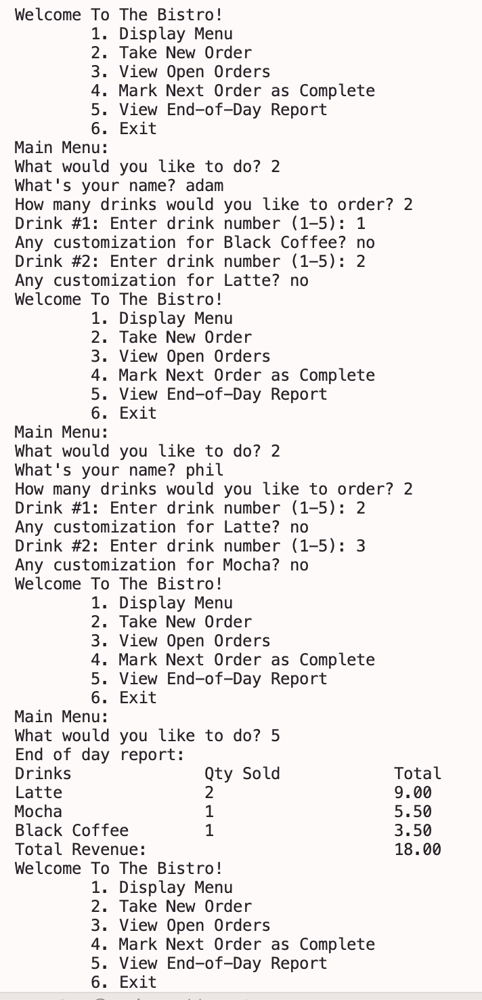

1. Menu: Array
2. Customer Order: Hash Map?
3. Order Confirmation: stack (liststack?)
4. Open Orders Queue: deque (doesn't have max size since it's linked list based)
5. Completed Orders/EOD Report: Bag

Limitations: Customer must give int input for menu choice, quantity of drinks, and drink number or program errors;
Customer can put in customization input but it is not repeated back to them in order summary

Example program

